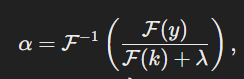
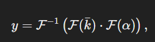
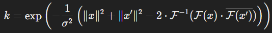

Алгоритм Continuous Sparse Kernel (CSK) для трекинга объектов описан в статье как подход, основанный на использовании циркулянтных матриц и преобразований Фурье. Вот пошаговое объяснение основного алгоритма:

### 1. **Формулировка задачи**:
   - CSK использует подход "треккинг через обнаружение" (tracking-by-detection).
   - Цель — построить классификатор, который обновляется на каждом кадре с использованием всех возможных подокон в изображении (dense sampling), а не только случайного подмножества.

---

### 2. **Циркулянтная структура данных**:
   - Для любого изображения x, плотная выборка (dense sampling) представлена всеми его циклическими сдвигами (например, сдвиги строк и столбцов).
   - Циркулянтная структура означает, что каждая строка матрицы описания данных является циклическим сдвигом первой строки.
   - Это позволяет эффективно представлять данные и выполнять вычисления в частотной области с помощью быстрого преобразования Фурье (FFT).

---

### 3. **Эффективное обучение классификатора**:
   - Обучение основано на минимизации регуляризованного квадратичного риска (Regularized Least Squares, RLS).
   - Для всех подоконов матрица ядра K имеет циркулянтную структуру. Это позволяет:
     - Представлять K компактно в виде вектора k, содержащего значения ядра для одного окна и всех его циклических сдвигов.
     - Избегать прямой инверсии матрицы, вместо этого выполнять операции в частотной области:
       
       где F — прямое преобразование Фурье, а lambda — параметр регуляризации.

---

### 4. **Распознавание (детекция) объекта**:
   - Для поиска объекта на следующем кадре используется оценка всех сдвигов нового изображения \( z \):
     
     где k — вектор ядерных значений между новым изображением и обучающим.

---

### 5. **Ядра и вычисления**:
   - Алгоритм поддерживает линейные и нелинейные ядра (например, гауссовские или полиномиальные). Они также вычисляются в частотной области для всех сдвигов:
     - Для гауссовского ядра:
       
       где x и x' — изображения.

---

### 6. **Шаги трекера**:
   1. **Обновление модели**:
      - Обучение модели alpha с использованием текущего изображения и позиции объекта.
   2. **Поиск объекта**:
      - Оценка ответов классификатора y для всех сдвигов изображения.
   3. **Обновление положения**:
      - Новая позиция определяется как максимум y.

---

### 7. **Преимущества алгоритма**:
   - **Скорость**: благодаря FFT обучение и детекция выполняются за O(n^2 log n) для изображений размера n * n.
   - **Простота реализации**: алгоритм можно реализовать в нескольких строках кода.
   - **Эффективность**: несмотря на простоту, CSK обеспечивает результаты, сопоставимые с современными методами.

Этот алгоритм особенно подходит для задач трекинга в реальном времени благодаря его высокой скорости и использованию всех подоконов для обучения модели.