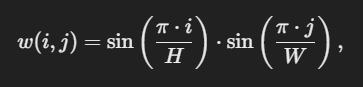
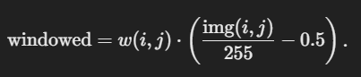
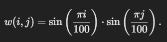

### Что такое косинусное окно?

**Косинусное окно** — это тип оконной функции, который используется для предобработки данных (в данном случае изображения) перед применением преобразования Фурье. Оно представляет собой матрицу весовых коэффициентов, где значения изменяются по косинусному закону, плавно уменьшаясь к краям. Основная цель использования косинусного окна — подавить нежелательные эффекты, возникающие при обработке данных в частотной области, такие как **утечки спектра** (*spectral leakage*).

---

### Математическое определение

Косинусное окно может быть определено как произведение двух одномерных косинусных окон в ортогональных направлениях:

где:
- H и W — высота и ширина окна соответственно,
- i и j — координаты пикселя в пределах окна.

Значения функции лежат в диапазоне ([0, 1]):
- Центр окна имеет максимальное значение (ближе к 1),
- Значения плавно убывают к краям (до 0).

---

### Зачем используется косинусное окно?

1. **Подавление краевых эффектов**:
   - При вычислении преобразования Фурье (FFT), данные предполагаются периодическими. Однако, если границы изображения содержат резкие переходы, это вызывает **утечки спектра**, т.е. появление дополнительных частотных компонент, которых на самом деле нет. Косинусное окно плавно "сглаживает" значения на краях, минимизируя этот эффект.

2. **Фокусировка на центральной области**:
   - Косинусное окно придает больший вес центральным частям изображения и уменьшает вклад краев. Это полезно, поскольку центральная область часто содержит основную информацию об объекте, а края могут быть менее информативны.

3. **Улучшение стабильности FFT**:
   - Уменьшение влияния резких градиентов в данных приводит к более стабильным и точным результатам при обработке в частотной области.

---

### Как косинусное окно используется в CSK?

1. **Применение окна**:
   - На каждом этапе трекинга вырезается регион интереса (ROI), содержащий объект. Перед обработкой на этот регион накладывается косинусное окно, умножающее значения пикселей на весовые коэффициенты.
   - Таким образом, центр региона сохраняет свои значения почти неизменными, а края сглаживаются.

2. **Обработка окна**:
   - Косинусное окно применяется к фрагменту, уже нормализованному к диапазону ([-0.5, 0.5]), где:   

3. **Преобразование Фурье**:
   - После наложения окна данные переходят в частотную область через FFT для дальнейших вычислений.

---

### Пример использования (в контексте CSK)

Допустим, мы вырезали фрагмент изображения с размером \(100 \times 100\). Применение косинусного окна выглядит так:

1. Создается окно w(i, j), где:
   

2. Каждое значение в окне варьируется от 0 (по краям) до 1 (в центре).

3. Изображение умножается на это окно:
   - Центральные пиксели остаются почти неизменными,
   - Краевые пиксели приглушаются (умножаются на значения близкие к 0).

---

### Преимущества косинусного окна

- **Эффективность**: Вычисление окна и его применение требуют минимальных вычислительных ресурсов.
- **Улучшение качества результатов**: Косинусное окно помогает уменьшить шумы и артефакты в частотной области.
- **Простота реализации**: Оно легко реализуется через элементарные операции с матрицами.

---

### Визуализация косинусного окна

Представьте, что вы смотрите на 3D-поверхность, где высота каждого пикселя соответствует весу окна. Косинусное окно будет выглядеть как мягкий "холм", максимальная высота которого находится в центре, а к краям высота плавно уменьшается до нуля.

--- 

