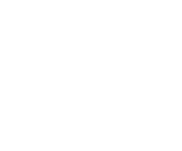

### Определение
*Преобразования Фурье* - это представление функции в виде суммы некой постоянной составляющей, первой гармоники
и высших гармоник. Такая сумма называется *рядом Фурье*. Чем больше гармоник, тем более точным получается приближение.

*Гармоника* - это некоторая функция, представимая в виде суммы синуса и косинуса,
имеющая амплитуду, начальную фазу и частоту.
*Первая гармоника* - функция, частота которой совпадает с частотой исходной функции.
*Высшая гармоника* - функция, частота которой в целое число раз больше частоты исходной функции.
#### Пример

*Разложение функции на разное число гармоник*

---

### Формула
Разложение осуществляется при помощи формулы:
$$f(t)= \frac{a_0}{2} + \displaystyle\sum_{k=1}^\infty[a_k \cos(k \omega_1 t) + b_k \sin(k \omega_2 t)]$$

где:
- $ \frac{a_0}{2} = \frac{1}{T}\int_0^T f(t) dt $ - постоянная составляющая
- $ \omega_1 = \frac{2\pi}{T} $ - угловая частота, скорость изменения волны 
- $ a_k = \frac{2}{T} \int_0^T f(t) \cos(k \omega_1 t) dt $ - просто коэффициент
- $ b_k = \frac 2 T \int_0^T f(t) \sin(k \omega_1 t) dt $ - просто коэффициент

---

### Комплексная форма

Преимуществом такой формы записи является компактность и то, что комплексное число
содержит информацию как об *амплитуде*, так и о *фазе* гармоники.
- *фаза* - угол, на который повернут график в какой-то момент времени
- *амплитуда* - максимальное отклонение графика от оси ox

Для приведения тригонометрических функций к комплексным числам, понадобится формула Эйлера:

$$ e^{i k \omega_1 t} = \cos(k \omega_1 t) + i \sin (k \omega_1 t) $$
$$ e^{- i k \omega_1 t} = \cos(k \omega_1 t) - i \sin (k \omega_1 t) $$

Из этих уравнений можно выразить:

$$ \cos(k \omega_1 t) = \frac {e^{i k \omega_1 t} + e^{- i k \omega_1 t}} {2} $$
$$ \sin(k \omega_1 t) = \frac {e^{i k \omega_1 t} - e^{- i k \omega_1 t}} {2 i} $$

Выполним подстановку в исходную формулу и после преобразований получим:

$$ f(t)= \frac{a_0}{2} + \displaystyle\sum_{k=1}^\infty[\frac{a_k - i b_k}{2}e^{i k \omega_1 t} + \frac{a_k + i b_k}{2}e^{- i k \omega_1 t}] $$

Дроби перед экспонентой являются комплексно сопряженными числами, введем для них обозначения:

$$ C_k = \frac{a_k - i b_k}{2}, C_{-k} = \frac{a_k + i b_k}{2}, C_0 = \frac {a_0}{2} $$

Эти обозначения называются *комплексными амплитудами*.

С учетом введенных обозначений, исходная формула примет вид:

$$ f(t)= C_0 + \displaystyle\sum_{k=1}^\infty[ C_k e^{i k \omega_1 t} + C_{-k} e^{- i k \omega_1 t}] $$

где:
- $ C_k = \frac 1 T \int_0^T f(t) e^{-i k \omega_1 t} dt $
- $ C_{-k} = \frac 1 T \int_0^T f(t) e^{i k \omega_1 t} dt $
- $ C_0 = \frac 1 T \int_0^T f(t) dt $

Эту формулу так же можно упростить:

$$ f(t) = \sum_{k=-\infty}^\infty C_k e^{i k \omega_1 t} $$

где:
- $ C_k = \frac 1 T \int_0^T f(t) e^{-i k \omega_1 t} dt $

--- 

### Дискретное преобразование
Для дискретных функций формула принимает следующий вид:

$$ X_k = \frac 1 N \sum_{n=0}^{N-1} x_n e^{-i\frac {2 \pi k n}{N}} $$

где:
- N - кол-во значений функции

Подставив данную формулу вместо $C_k$ получим преобразование Фурье для дискретной функции.

Коэффициент $ \frac 1 N $ в формуле часто опускается.

Экспоненту $ e^{-i\frac {2 \pi k n}{N}} $ называют *поворотным множителем*,
так как коэффициент при $i$ в показателе степени равен углу поворота.

---

### Быстрое преобразование

Расчет поворотных множителей в $X_k$ является самым трудоемким этапом вычислений,
так для одной гармоники $X_k$ требуется $N$ операций.

Это значит что для разложения функции на сумму из $N$ гармоник потребуется $N \times N$ операций.

Однако можно оптимизировать этот этап. Для этого при вычислении
$X_k$ будем суммировать поворотные множители только с четными $n$.

Тогда, чтобы найти сумму для оставшихся множителей с нечетными числами,
можно будет взять вычисленную сумму и сместить её на коэффициент из степени.

Таким же образом можно будет оптимизировать вычисления для суммы четных множителей:
возьмем множители с четными индексами, посчитаем их сумму и прибавим к ней коэффициент, 
чтобы вычислить сумму для оставшихся множителей.

Тогда алгоритм вычисления $X_k$ можно представить в виде дерева:

